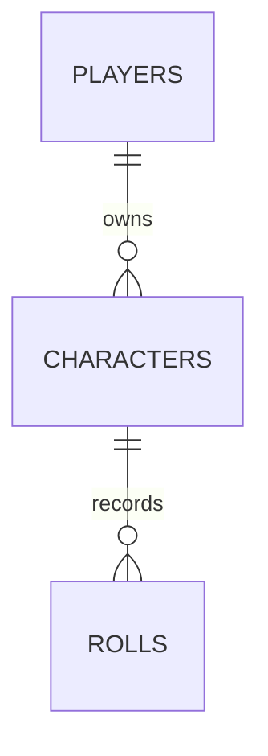

# Database schema

Concrete shape of the PostgreSQL schema. Read this before writing a migration, an
entity, or any query. For the conceptual model behind it, see `domain-model.md`.
For why PostgreSQL and JSONB at all, see `decisions/adr-0001-postgresql-with-jsonb.md`.

## Overview

Three tables. The variety between game systems lives inside the `sheet` payload, not
in additional tables. **Needing a new table to support a new game system means the
design failed** — raise it instead of adding one.

Keycloak keeps its own separate database in the same PostgreSQL instance. It is not
part of this schema and must never be joined against.

## `players`

Local mirror of the authenticated identity. Holds no credentials.

| Column | Type | Notes |
| --- | --- | --- |
| `id` | `uuid` | Primary key, generated by the application |
| `subject` | `text` | Unique. The `sub` claim from the access token |
| `display_name` | `text` | Shown in the UI |
| `created_at` | `timestamptz` | |

`subject` is the only bridge between Keycloak and this schema. Every ownership check
resolves through it. **Ownership is never derived from an identifier supplied by the
client** — that is how one player reads another player's characters.

## `characters`

| Column | Type | Notes |
| --- | --- | --- |
| `id` | `uuid` | Primary key |
| `player_id` | `uuid` | FK to `players`, not null |
| `system_id` | `text` | Game system identifier, e.g. `dnd-5e` |
| `name` | `text` | Not null |
| `portrait_key` | `text` | Object key in storage, nullable |
| `backstory` | `text` | Free-form, nullable |
| `sheet` | `jsonb` | System-specific payload, not null |
| `sheet_schema_version` | `int` | Not null |
| `created_at` | `timestamptz` | |
| `updated_at` | `timestamptz` | |
| `deleted_at` | `timestamptz` | Null while active — soft delete |

## `rolls`

Append-only. Rows are never updated or deleted, including when their character is
deleted.

| Column | Type | Notes |
| --- | --- | --- |
| `id` | `uuid` | Primary key |
| `character_id` | `uuid` | FK to `characters`, not null |
| `expression` | `text` | The rolled expression, e.g. `8d6` |
| `context` | `text` | Human-readable trigger, e.g. `Fireball damage` |
| `results` | `int[]` | Individual die results, in roll order |
| `total` | `int` | Final result after modifiers |
| `rolled_at` | `timestamptz` | Not null |

Storing `results` alongside `total` makes a roll reconstructable after the fact, which
is the point of keeping a history at all.

## Design decisions

### No `game_systems` table

Game systems are code, so the strategy registry is the single source of truth. A table
would be a second source of truth and would drift from the code.

Trade-off accepted: the database cannot enforce that `system_id` refers to a system
that exists. Java validates it on write. This is tolerable because the value never
comes from free user input — it comes from a list the API itself publishes.

### `sheet_schema_version` is a column, not a JSON field

Keeping it outside the payload makes "how many sheets are still on version 1" a plain
`WHERE` clause instead of a scan through JSONB. That query matters on the day a sheet
format changes, and that day will come.

Mirror the value inside the Java record so the payload stays self-describing, but the
column is authoritative.

### `portrait_key` stores the object key, not a URL

A URL embeds host and port, which differ between the development machine and the
deployment VM. Storing only the key lets the backend build the URL from configuration,
so changing storage provider touches no rows.

### `backstory` is `text`, and that is enough

`text` in PostgreSQL has no practical limit — roughly 1 GB per value. Twenty thousand
characters is 20–60 KB in UTF-8, which is nothing. `varchar(n)` would be the wrong
choice: PostgreSQL gains no performance from a length limit.

Values above roughly 2 KB are TOASTed — compressed and moved to a side table, leaving a
pointer in the row. A query selecting `id, name, system_id` therefore does not pay for
anyone's backstory. The database already performs the normalization one might be
tempted to do by hand, so **do not move `backstory` to its own table**.

Consequences worth knowing:

- The real ceiling is transport, not storage. A failure on a very long backstory will
  come from the maximum request size in Tomcat or a proxy.
- Never put `backstory` under a B-tree index — an index entry cannot exceed about
  2.7 KB. If searching inside it is ever needed, use `tsvector` with a GIN index.
- Apply an application-level cap through Bean Validation (100,000 characters is a
  reasonable starting point). This is hygiene against accidental pastes, not a
  technical constraint.
- `backstory` is common to every game system, so it is a column. It never goes in
  `sheet`.

### Soft delete

Deleting a character sets `deleted_at`; the roll history survives. **Every query
against `characters` must filter `deleted_at IS NULL`.** Centralize that filter in one
place rather than repeating it — a forgotten filter silently resurrects deleted
characters.

## Indexes

| Index | Reason |
| --- | --- |
| `characters (player_id)` | Every listing goes through it |
| `characters` GIN on `sheet` | Querying inside the JSONB payload |
| `rolls (character_id, rolled_at DESC)` | History is read newest first |
| `players (subject)` unique | Resolved on every authenticated request |

## Migration rules

Every change here is a Flyway migration under
`apps/api/src/main/resources/db/migration`, named `V{n}__{description}.sql`.
Migrations are append-only: never edit one that has been applied. `ddl-auto` stays
`validate`, so Hibernate never alters the schema.

Adding a game system requires no migration. If a proposed change would require one,
that is a signal to re-read `decisions/adr-0003-code-per-game-system.md` first.