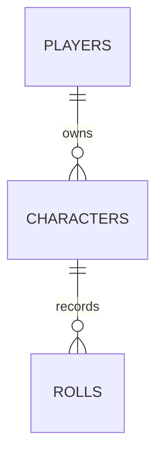

# Database schema

Concrete shape of the PostgreSQL schema. Read this before writing a migration, an
entity, or any query. For the conceptual model behind it, see `domain-model.md`.
For why PostgreSQL and JSONB at all, see `decisions/adr-0001-postgresql-with-jsonb.md`.

## Overview

```mermaid
erDiagram
  PLAYERS ||--o{ CHARACTERS : owns
  CHARACTERS ||--o{ ROLLS : records
```

Four tables. `catalogue_entries` has no relationship to the other three — it is
reference data, not owned by a player or a character, and every authenticated player
reads the same rows. The variety between game systems lives inside the `sheet` and
`data` payloads, not in additional tables. **Needing a new table to support a new game
system means the design failed** — raise it instead of adding one. (`catalogue_entries`
itself is not an exception to this: it was added once, in phase 7, to hold reference
content for every system; a second system reuses the same table via its own
`system_id` value, not a new one.)

Keycloak keeps its own separate database in the same PostgreSQL instance. It is not
part of this schema and must never be joined against.

## `players`

Local mirror of the authenticated identity. Holds no credentials.

| Column | Type | Notes |
| --- | --- | --- |
| `id` | `uuid` | Primary key, generated by the application |
| `subject` | `text` | Unique. The `sub` claim from the access token |
| `display_name` | `text` | Shown in the UI |
| `created_at` | `timestamptz` | |

`subject` is the only bridge between Keycloak and this schema. Every ownership check
resolves through it. **Ownership is never derived from an identifier supplied by the
client** — that is how one player reads another player's characters.

## `characters`

| Column | Type | Notes |
| --- | --- | --- |
| `id` | `uuid` | Primary key |
| `player_id` | `uuid` | FK to `players`, not null |
| `system_id` | `text` | Game system identifier, e.g. `dnd-5e` |
| `name` | `text` | Not null |
| `portrait_key` | `text` | Object key in storage, nullable |
| `backstory` | `text` | Free-form, nullable |
| `sheet` | `jsonb` | System-specific payload, not null |
| `sheet_schema_version` | `int` | Not null |
| `created_at` | `timestamptz` | |
| `updated_at` | `timestamptz` | |
| `deleted_at` | `timestamptz` | Null while active — soft delete |
| `status` | `text` | Not null, default `ACTIVE`; `DRAFT` or `ACTIVE` (check constraint). V5. |
| `creation_draft` | `jsonb` | The system's build document while `status = 'DRAFT'`, possibly incomplete; null once finished. A check constraint requires it for a draft. V5. |
| `level_up_draft` | `jsonb` | A level up in progress on an active character: `{classSlug, classLevel, build, openedChoiceIds}`, the build with the new level and the choices it left pending when it started (absent in older drafts, read as none). Null when none; the sheet only changes when it is finished. V9. |

A draft keeps `sheet = {}` and `sheet_schema_version = 0` until the creation flow
finishes it. That writes the materialized sheet, sets `ACTIVE` and clears
`creation_draft`. The sheet and roll endpoints refuse a draft (409), except
`POST /api/characters/{id}/rolls/creation`: the builder's ability and hit point
rolls, which land in the character's roll history.

**Data migration V8** rewrote stored D&D 5e sheets. It touches no columns.
- Class and subclass features in `featureTraits` now name their class as
  `source`, with no level ("Fighter", not "Fighter 3" or "Battle Master 3").
- The feature that grants the subclass lists it in `choices`.
- The subclass-granting feature is found through `catalogue_entries`: a
  feature at the class's `subclassLevel` with `grantsSubclassFeature`.

## `rolls`

Append-only. Rows are never updated or deleted, including when their character is
deleted.

| Column | Type | Notes |
| --- | --- | --- |
| `id` | `uuid` | Primary key |
| `character_id` | `uuid` | FK to `characters`, not null |
| `expression` | `text` | The rolled expression, e.g. `8d6` |
| `context` | `text` | Human-readable trigger, e.g. `Fireball damage` |
| `results` | `int[]` | Individual die results, in roll order |
| `total` | `int` | Final result after modifiers |
| `rolled_at` | `timestamptz` | Not null |

Storing `results` alongside `total` makes a roll reconstructable after the fact, which
is the point of keeping a history at all.

## `catalogue_entries`

Reference data: spells, items, features and creatures — see adr-0005. Not owned by a
player; no ownership column, no soft delete. Loaded by the import pipeline
(`CatalogueImportService`/`CatalogueImportRunner`), never written by a player-facing
endpoint.

| Column | Type | Notes |
| --- | --- | --- |
| `id` | `uuid` | Primary key |
| `system_id` | `text` | Game system identifier, same values as `characters.system_id` |
| `kind` | `text` | `SPELL` \| `ITEM` \| `FEATURE` \| `CREATURE` \| `BACKGROUND` \| `FEAT` \| `CLASS` \| `SUBCLASS` \| `OPTIONAL_FEATURE` \| `SPECIES` \| `LANGUAGE` — no check constraint; the Java enum `CatalogueEntryKind` is the only gate |
| `slug` | `text` | Stable machine identifier from the source file, e.g. `fireball` |
| `name` | `text` | Not null |
| `source_book` | `text` | Nullable. The source's full name, e.g. `Player's Handbook` |
| `source_code` | `text` | Nullable. The source's 5etools code, e.g. `PHB`. Added in V6 (2026-09-25) |
| `source_page` | `int` | Nullable |
| `tags` | `text[]` | Not null, defaults to empty |
| `description` | `text` | Nullable. The one redactable field — see adr-0005 |
| `data` | `jsonb` | Not null. Mechanical fields, shape varies by `kind` and `system_id` |
| `created_at` / `updated_at` | `timestamptz` | |

`UNIQUE (system_id, kind, slug)` is the natural key: re-running the import updates the
matching row in place instead of duplicating it, which is what makes the import
reproducible (roadmap.md phase 7's "Done when"). An import also deletes rows of each
imported (system, kind) whose slug no longer has a file in the directory, so a
renamed slug never leaves an orphan behind.

`description` is redacted at the API layer, never in the database — the column always
holds the real text. See `RedactableText` and `CatalogueService`.

## `spring_session` and `spring_session_attributes`

Browser sessions (adr-0008), added in V7 (2026-09-26). This is Spring Session
JDBC's own PostgreSQL schema, created by Flyway;
`spring.session.jdbc.initialize-schema` is `never`.
- **Written by:** Spring Session only. No entity maps them.
- **`spring_session`:** one row per session. `principal_name` is the Keycloak
  subject (`sub`); `expiry_time` is in epoch milliseconds. Spring Session
  deletes expired rows every minute.
- **`spring_session_attributes`:** the serialized session attributes: the login
  and its `OAuth2AuthorizedClient` (access and refresh tokens). Deleting a row
  from `spring_session` removes its attributes too (`ON DELETE CASCADE`).
- **Inspecting:** `select session_id, principal_name, to_timestamp(expiry_time /
  1000) from spring_session;` lists who is signed in and until when. Deleting a
  row signs that browser out.

## Design decisions

### No `game_systems` table

Game systems are code, so the strategy registry is the single source of truth. A table
would be a second source of truth and would drift from the code.

Trade-off accepted: the database cannot enforce that `system_id` refers to a system
that exists. Java validates it on write. This is tolerable because the value never
comes from free user input — it comes from a list the API itself publishes.

### `sheet_schema_version` is a column, not a JSON field

Keeping it outside the payload makes "how many sheets are still on version 1" a plain
`WHERE` clause instead of a scan through JSONB. That query matters on the day a sheet
format changes, and that day will come.

Mirror the value inside the Java record so the payload stays self-describing, but the
column is authoritative.

D&D 5e sheet versions:

- **1** — the original flat sheet.
- **2** (2026-09-23) — adds the optional `build` object (`Dnd5eCharacterBuild`).

A version-1 row reads as version 2 with `build: null`, so no migration is needed.
The column is set to 2 when a sheet is first written with a build.

### `portrait_key` stores the object key, not a URL

A URL embeds host and port, which differ between the development machine and the
deployment VM. Storing only the key lets the backend build the URL from configuration,
so changing storage provider touches no rows.

Two shapes (D2j, 2026-09-25):
- `preset:<id>`: one of the web app's bundled default portraits. For D&D 5e the
  id is D&D Beyond's avatar id;
- `uploads/<character id>/<uuid>.png`: an uploaded object in the portrait bucket.

The entity maps the column `updatable = false`. It is written only by
`CharacterRepository.updatePortraitKey`, a targeted `UPDATE`, so a whole-entity
save such as a draft autosave that loaded the row earlier can never put back a
stale portrait.

### `backstory` is `text`, and that is enough

`text` in PostgreSQL has no practical limit — roughly 1 GB per value. Twenty thousand
characters is 20–60 KB in UTF-8, which is nothing. `varchar(n)` would be the wrong
choice: PostgreSQL gains no performance from a length limit.

Values above roughly 2 KB are TOASTed — compressed and moved to a side table, leaving a
pointer in the row. A query selecting `id, name, system_id` therefore does not pay for
anyone's backstory. The database already performs the normalization one might be
tempted to do by hand, so **do not move `backstory` to its own table**.

Consequences worth knowing:

- The real ceiling is transport, not storage. A failure on a very long backstory will
  come from the maximum request size in Tomcat or a proxy.
- Never put `backstory` under a B-tree index — an index entry cannot exceed about
  2.7 KB. If searching inside it is ever needed, use `tsvector` with a GIN index.
- Apply an application-level cap through Bean Validation (100,000 characters is a
  reasonable starting point). This is hygiene against accidental pastes, not a
  technical constraint.
- `backstory` is common to every game system, so it is a column. It never goes in
  `sheet`.

### Soft delete

Deleting a character sets `deleted_at`; the roll history survives. **Every query
against `characters` must filter `deleted_at IS NULL`.** Centralize that filter in one
place rather than repeating it — a forgotten filter silently resurrects deleted
characters.

## Indexes

| Index | Reason |
| --- | --- |
| `characters (player_id)` | Every listing goes through it |
| `characters` GIN on `sheet` | Querying inside the JSONB payload |
| `rolls (character_id, rolled_at DESC)` | History is read newest first |
| `players (subject)` unique | Resolved on every authenticated request |

## Migration rules

Every change here is a Flyway migration under
`apps/api/src/main/resources/db/migration`, named `V{n}__{description}.sql`.
Migrations are append-only: never edit one that has been applied. `ddl-auto` stays
`validate`, so Hibernate never alters the schema.

Adding a game system requires no migration. If a proposed change would require one,
that is a signal to re-read `decisions/adr-0003-code-per-game-system.md` first.